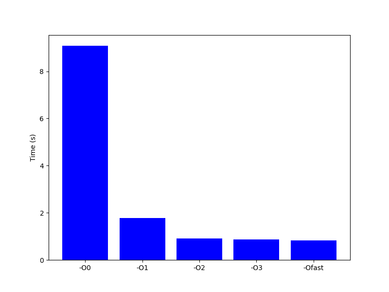
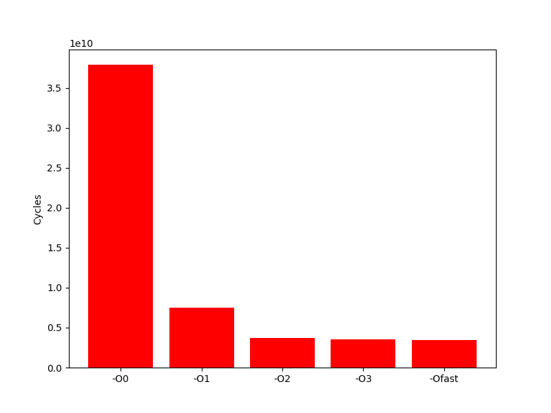
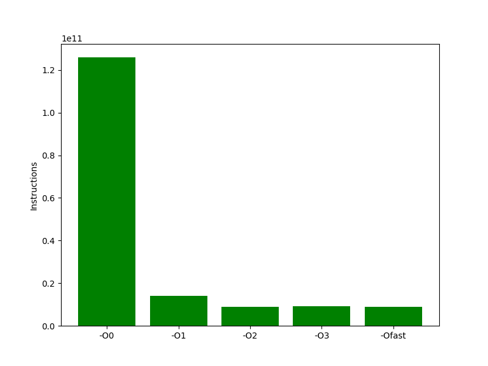

# indic-perf
Benchmarks de performance via indicateurs de performance CPU.

---
Nous avons utilisé un programme multipliant deux matrices de 1000x1000.
Pour monitorer le CPU pendant la multiplication, nous avons effectuer nos benchmarks avec deux outils différents : 
- perf, qui utilise libpfm4
- linux/perf_event.h, un fichier d'en-tête fourni par le noyau Linux. Il définit l'interface de programmation pour l'infrastructure de suivi de performance du noyau Linux, appelée "perf". Cette interface est utilisée pour configurer et accéder aux compteurs de performance du matériel.

Nous avons écrit un script bash qui compile le programme dans 5 options de compilations différentes :
- O0
- O1
- O2
- O3
- Ofast

Ensuite, il va lancer 5 fois l'analyse du binaire de chacun de ces modes avec la commande perf, le tout encapsulé par `time` pour mesurer le temps d'éxécution : 
```sh
time perf stat -e cycles,instructions,cache-references,cache-misses,branches,branch-misses
```

Le premier est un simple programme. Le deuxième est un programme qui inclue dans le code les outils d'analyse avec compteurs matériels de performances, de manière similaire à `libpfm4`, à l'aide de `<linux/perf_event.h>`.
Le script bash effectue une tache similaire.

Nous avons ensuite utiliser python et `matplotlib` pour générér nos graphiques avec nos résultats.
Voici par exemple le temps d'éxécution, le nombre d'instructions, et le nombres de cycles pour la multiplication avec `-O3` :





---

Les benchmarks sont disponibles dans les fichiers suivants :
- results_bench_perf_event.txt pour le code utilisant `<linux/perf_event.h>`, similaire à `libpfm4`
- results_bench_perf.txt pour le code utilisant l'outil [`perf`](https://github.com/brendangregg/perf-tools) 
